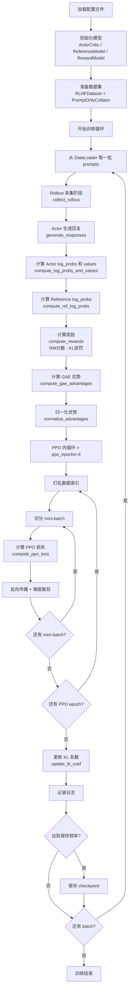

# RLHF-PPO 实现详解

## 1. 项目概述

### 1.1 什么是 RLHF

RLHF（Reinforcement Learning from Human Feedback，基于人类反馈的强化学习）是目前训练大型语言模型（LLM）使其与人类意图对齐的主流方法。其核心思想是：先收集人类对模型输出的偏好数据，训练一个奖励模型（Reward Model）来模拟人类偏好，再用强化学习算法优化语言模型，使其生成更符合人类期望的回复。

### 1.2 PPO 算法简介

PPO（Proximal Policy Optimization，近端策略优化）是 OpenAI 提出的一种 on-policy 强化学习算法。相比 TRPO，PPO 通过裁剪（clip）目标函数来约束策略更新幅度，实现简单且训练稳定，是目前 RLHF 中最常用的 RL 算法。

在 RLHF 场景下，PPO 的核心目标是：

$$\max_\theta \mathbb{E}_{x \sim \mathcal{D}, y \sim \pi_\theta(\cdot|x)} \left[ r_\phi(x, y) - \beta \cdot \text{KL}[\pi_\theta(\cdot|x) \| \pi_{\text{ref}}(\cdot|x)] \right]$$

其中 $r_\phi$ 是奖励模型打分，$\pi_{\text{ref}}$ 是参考模型（SFT 模型），$\beta$ 是 KL 惩罚系数。

### 1.3 本项目功能

本项目提供**两套独立的 PPO RLHF 训练实现**，具备以下特性：

- 支持 Qwen2.5-7B-Instruct 作为 Actor/Reference 模型
- 支持 InternLM2-7B-Reward 作为奖励模型
- 支持 LoRA 微调，显著降低显存占用
- 支持梯度检查点加速训练
- 支持 COIG-CQIA、UltraFeedback、HH-RLHF 等多个数据集
- 实现了完整的 GAE 优势估计、PPO 裁剪损失、自适应 KL 系数调整（自定义实现）
- 基于 TRL 库的标准 PPO 实现（trl_ppo 实现）

---

## 2. 项目结构

本项目包含两套独立的 PPO 实现，共享同一套数据和模型下载脚本。

```
rlhf-ppo/
├── config/                           # 自定义 PPO 实现的配置文件
│   ├── model_config.yml              # 模型路径、数据集、序列长度、LoRA 配置
│   ├── ppo_config.yml                # PPO 超参数（clip、gamma、lam、学习率等）
│   └── eval_log_config.yml           # 输出目录、保存频率、评估频率
├── trl_ppo/                          # TRL-based PPO 实现
│   ├── config.yml                    # 单一统一配置文件
│   └── trainer.py                    # TRLPPOTrainer：封装 trl.experimental.ppo
├── models/
│   ├── qwen2.5-7b-instruct/          # Actor / Reference / Value 模型权重
│   └── internlm2-7b-reward/          # 奖励模型权重
├── scripts/
│   ├── train.py                      # 自定义 PPO 训练入口
│   ├── quick_start.py                # TRL PPO 训练入口
│   ├── download_model.py             # 从 hf-mirror.com 下载 Actor 模型
│   ├── download_reward_model.py      # 从 hf-mirror.com 下载奖励模型
│   └── download_dataset.py           # 下载并预处理数据集，保存为 JSONL
└── src/                              # 自定义 PPO 实现的核心代码
    ├── data/
    │   ├── dataset.py                # RLHFDataset：加载 JSONL 或 HuggingFace 格式数据
    │   └── collator.py               # PromptOnlyCollator / FullSequenceCollator
    ├── models/
    │   ├── actor_critic.py           # ActorCritic：LLM + value head，支持 LoRA
    │   ├── reference_model.py        # ReferenceModel：冻结的 LLM，仅用于推理
    │   └── reward_model.py           # RewardModel：冻结的 AutoModel，自动检测输出格式
    └── ppo/
        ├── rollout.py                # RolloutCollector：采样、计算 log_probs 和奖励
        ├── advantage.py              # GAE 优势函数计算与归一化
        ├── loss.py                   # PPO 策略损失、价值损失、熵奖励
        └── trainer.py                # PPOTrainer：主训练循环，整合所有模块
```

---

## 3. 两种实现方案对比

| 维度 | 自定义 PPO（`src/`） | TRL PPO（`trl_ppo/`） |
|------|---------------------|----------------------|
| 入口 | `scripts/train.py` | `scripts/quick_start.py` |
| 配置 | 3 个独立 yml 文件 | 1 个统一 `trl_ppo/config.yml` |
| Actor+Critic | 共享同一 LLM 主干，顶部加 value_head | 独立的 policy 模型和 value 模型 |
| Reference 模型 | 始终单独加载 | LoRA 模式下 ref_policy=None（TRL 自动禁用 adapter） |
| 奖励模型接口 | `RewardModel.compute_reward()` 直接调用 | `InternLM2RewardWrapper` 适配 TRL 的 `get_reward()` 接口 |
| Tokenizer 差异处理 | 奖励模型使用自己的 tokenizer | `_RetokenizingBackbone` 解码→重编码，广播 hidden state |
| PPO 循环 | 手动实现 mini-batch 内循环 | 委托给 `trl.experimental.ppo.PPOTrainer` |
| KL 系数 | 自适应调整（target_kl=0.01，±1.5x） | 固定 kl_coef=0.05 |
| GPU 分配 | config 中 device_maps 字段 | config 中 visible_gpus + device_maps 字段 |

---

## 4. 核心概念：四个模型的角色

RLHF-PPO 训练中同时涉及四个模型，理解它们的关系是理解整个框架的关键。

### 4.1 Actor 模型（策略网络）

Actor 是我们要训练的语言模型，对应强化学习中的"策略" $\pi_\theta$。它接收用户的 prompt，生成回复。训练目标是让它生成的回复获得更高的奖励，同时不偏离参考模型太远。

- 自定义实现：`ActorCritic`（`src/models/actor_critic.py`），与 Critic 共享同一 LLM 主干
- TRL 实现：独立的 `AutoModelForCausalLM`（policy 模型）
- 基础模型：Qwen2.5-7B-Instruct
- 训练方式：LoRA 微调（仅更新少量参数）

### 4.2 Critic 模型（价值网络）

Critic 估计当前状态的期望累积奖励，即价值函数 $V(s)$。

- 自定义实现：与 Actor 共享同一 LLM 主干，顶部额外添加 `nn.Linear(hidden_size, 1)` 作为 value_head
- TRL 实现：独立的 `AutoModelForSequenceClassification`（num_labels=1），与 policy 模型完全分离

### 4.3 Reference 模型（参考策略）

Reference 模型是 Actor 的初始版本（SFT 模型），在整个训练过程中保持冻结。通过 KL 散度惩罚防止 Actor 偏离太远，避免奖励黑客（reward hacking）。

- 自定义实现：`ReferenceModel`（`src/models/reference_model.py`），始终单独加载，完全冻结
- TRL 实现：使用 LoRA 时 ref_policy=None，TRL 内部通过禁用 adapter 来获取参考输出；不使用 LoRA 时单独加载

### 4.4 Reward 模型（奖励模型）

Reward 模型输入 prompt+response，输出一个标量分数，代表该回复的质量。在 RLHF 阶段保持冻结。

- 自定义实现：`RewardModel`（`src/models/reward_model.py`），使用 `AutoModel` 加载，自动检测输出属性（logits/scores/end_scores/direct）
- TRL 实现：`InternLM2RewardWrapper`，通过 `_RetokenizingBackbone` 处理 policy tokenizer 与 reward tokenizer 不一致的问题
- 基础模型：InternLM2-7B-Reward

### 4.5 四模型关系图

```
训练数据 (prompts)
       │
       ▼
┌─────────────┐    生成回复     ┌──────────────────┐
│   Actor     │ ─────────────► │  生成的回复        │
│  (可训练)   │                └──────────────────┘
└─────────────┘                        │
       │                               ├──────────────────────────┐
       │ 共享主干（自定义实现）           │                          │
       ▼                               ▼                          ▼
┌─────────────┐              ┌──────────────────┐    ┌──────────────────┐
│   Critic    │              │  Reward Model    │    │ Reference Model  │
│  (可训练)   │              │   (冻结)         │    │    (冻结)        │
│  价值估计   │              │  输出奖励分数     │    │  输出参考log概率  │
└─────────────┘              └──────────────────┘    └──────────────────┘
       │                               │                          │
       │ V(s)                          │ r_φ(x,y)                │ log π_ref
       └───────────────────────────────┴──────────────────────────┘
                                       │
                                       ▼
                              计算 GAE 优势 + PPO 损失
                                       │
                                       ▼
                              更新 Actor + Critic 参数
```

---

## 4. 训练流程（自定义 PPO）

### 4.1 整体流程图



### 4.2 逐步详解

#### 步骤 1：初始化（`PPOTrainer.__init__` + `setup()`）

加载三个配置文件，初始化 `kl_coef=0.1`、`target_kl=0.01`、`global_step=0`。`setup()` 依次创建 `ActorCritic`、`ReferenceModel`、`RewardModel`、`RolloutCollector`，以及 AdamW 优化器（两个参数组）。

#### 步骤 2：Rollout 采集（`RolloutCollector.collect_rollout()`）

on-policy 训练的核心阶段，每步都用当前策略重新采样。依次执行：
1. `generate_responses`：生成回复
2. `compute_log_probs_and_values`：计算 Actor log_probs、values、loss_mask
3. `compute_ref_log_probs`：计算 Reference log_probs（无梯度）
4. `compute_rewards`：RM 分数 + KL 惩罚组合成 token 级奖励

所有张量在返回前 `.detach()`，避免保留计算图。

#### 步骤 3：GAE 优势计算 + 归一化

从后向前迭代计算 GAE 优势和折扣回报，然后只在 response 位置（`loss_mask=1`）做均值/标准差归一化。

#### 步骤 4：PPO 内循环（`ppo_epochs=4` × mini-batches）

对同一批 rollout 数据重复训练 4 次，每次随机打乱后切分 mini-batch（`mini_batch_size=2`），调用 `compute_ppo_loss` 计算三项损失，反向传播，梯度裁剪（`max_grad_norm=1.0`），更新参数。

#### 步骤 5：自适应 KL 系数更新

```python
mean_kl = (kl_divergences * loss_mask).sum() / loss_mask.sum()
if mean_kl > target_kl * 1.5:
    kl_coef = min(kl_coef * 1.5, 10.0)
elif mean_kl < target_kl / 1.5:
    kl_coef = max(kl_coef / 1.5, 1e-4)
```

---

## 5. 数据处理

### 5.1 RLHFDataset（`src/data/dataset.py`）

数据集类支持两种加载方式：

1. **预处理 JSONL**：如果 `train_path`/`val_path` 文件存在，直接逐行加载 JSON
2. **原始 HuggingFace 格式**：从 `raw_dir` 加载磁盘上的 HuggingFace Dataset

每条数据的格式：
```json
{
  "prompt": "用户的问题或指令",
  "chosen": "人类偏好的回复（可选）",
  "rejected": "人类不偏好的回复（可选）"
}
```

PPO 训练阶段只使用 `prompt` 字段，`chosen`/`rejected` 是可选的（用于 SFT/DPO 等其他阶段）。

### 5.2 PromptOnlyCollator（`src/data/collator.py`）

用于 PPO 训练的 DataLoader，只处理 prompt，使用**左填充**（`padding_side='left'`），使生成时所有序列的实际内容都在右侧，便于批量生成。返回 `input_ids`、`attention_mask`、`prompts`（原始文本列表）。

### 5.3 FullSequenceCollator（`src/data/collator.py`）

用于监督微调场景，处理完整的 prompt+response 序列：
- 使用 `tokenizer.apply_chat_template()` 格式化完整对话
- 创建 `loss_mask`：prompt token 位置为 0，response token 位置为 1
- 使用**右填充**到 batch 内最大长度

### 5.4 TRL PPO 数据加载（`trl_ppo/trainer.py`）

TRL 实现中数据加载更简单，直接读取 JSONL 文件，用 `prompt_template` 格式化后 tokenize，返回 HuggingFace `Dataset` 对象传给 `PPOTrainer`。

---

## 6. 模型架构

### 6.1 ActorCritic（`src/models/actor_critic.py`）

ActorCritic 是自定义实现中唯一需要训练的模型，将语言模型主干和价值头合二为一。

**初始化流程：**
1. 加载 `AutoModelForCausalLM`（bfloat16，device_map 来自 config）
2. 加载 `AutoTokenizer`，若无 pad_token 则设为 eos_token
3. 添加 `value_head = nn.Linear(hidden_size, 1)`，dtype 与模型一致
4. 若 `lora.enable=True`，通过 peft 的 `get_peft_model()` 应用 LoRA
5. 若配置了梯度检查点，调用 `gradient_checkpointing_enable()`，同时禁用 `use_cache`
6. 将 value_head 移到与模型第一个参数相同的设备

**forward() 方法：**

```python
outputs = model(input_ids, attention_mask, output_hidden_states=True)
logits = outputs.logits                          # [B, T, vocab_size]
last_hidden_state = outputs.hidden_states[-1]    # [B, T, hidden_size]
values = value_head(last_hidden_state).squeeze(-1)  # [B, T]
return {"logits": logits, "values": values, "hidden_states": ...}
```

**get_trainable_params() 方法：**

返回两个参数组，分别设置不同学习率：
```python
[
    {"params": backbone_params, "lr": 1e-6},    # LoRA 参数（主干）
    {"params": value_head_params, "lr": 1e-5},  # value head 参数
]
```

### 6.2 ReferenceModel（`src/models/reference_model.py`）

与 ActorCritic 使用相同的基础模型，但完全冻结（`eval()` + `requires_grad_(False)`）。推理时使用 `inference_mode` 上下文管理器，内部使用 `torch.inference_mode()` + `torch.amp.autocast()` 加速。只返回 logits，没有 value head。

### 6.3 RewardModel（`src/models/reward_model.py`）

使用 `AutoModel`（非 `AutoModelForSequenceClassification`）加载 InternLM2-7B-Reward。

**关键特性：**

- **rope_scaling 兼容性修复**：InternLM2 的 rope_scaling 配置与新版 transformers 存在键名不兼容问题，代码自动修复（`rope_type` → `type`，补充 `factor` 字段，过滤无效 type）
- **attn_implementation**：强制设为 `"eager"` 避免 flash attention 兼容问题
- **输出格式自动检测**：`_detect_output_attr()` 通过 dummy forward pass 检测输出属性名（`logits`/`scores`/`end_scores`/`direct`）
- **tokenizer 加载容错**：先尝试 fast tokenizer，失败则回退到 slow tokenizer

**compute_reward() 方法：**

```python
texts = [format_input(p, r) for p, r in zip(prompts, responses)]
inputs = tokenizer(texts, padding=True, truncation=True, max_length=2048)
rewards = forward(input_ids, attention_mask)  # [batch_size]
```

### 6.4 InternLM2RewardWrapper（`trl_ppo/trainer.py`）

TRL 实现中的奖励模型包装器，用于适配 TRL 的 `get_reward()` 接口。

TRL 的 `get_reward()` 期望：
```python
lm_backbone = getattr(model, model.base_model_prefix)
output = lm_backbone(input_ids, ..., output_hidden_states=True)
reward_logits = model.score(output.hidden_states[-1])
```

由于 policy 和 reward 使用不同的 tokenizer，`_RetokenizingBackbone` 在 forward 时：
1. 将 policy token IDs 解码为文本
2. 用 reward tokenizer 重新编码
3. 运行 reward backbone 得到 hidden states
4. 取最后一个非 pad 位置的 hidden state
5. 广播到 policy 序列长度（确保 TRL 的 sequence_lengths 索引安全）

`InternLM2RewardWrapper` 还负责：
- 从原始 reward 模型权重中复制 score head（尝试 `reward_head`/`score`/`value_head`/`classifier` 等属性名）
- 设置 `base_model_prefix = "model"` 以匹配 TRL 接口

---

## 7. Rollout 采集详解（自定义实现）

### 7.1 RolloutBatch 数据结构

`RolloutBatch` 是一个 dataclass，存储一次 rollout 采集的所有数据：

| 字段 | 形状 | 含义 |
|------|------|------|
| `input_ids` | `[B, T]` | prompt+response 的完整 token ids |
| `attention_mask` | `[B, T]` | 注意力掩码（全 1） |
| `action_log_probs` | `[B, T]` | Actor 在每个位置的 log 概率（已 detach） |
| `ref_log_probs` | `[B, T]` | Reference 在每个位置的 log 概率（已 detach） |
| `values` | `[B, T]` | Critic 在每个位置的价值估计（已 detach） |
| `rewards` | `[B, T]` | 每个位置的奖励（含 KL 惩罚，已 detach） |
| `prompts` | `List[str]` | 原始 prompt 文本 |
| `responses` | `List[str]` | 生成的 response 文本 |
| `prompt_lengths` | `List[int]` | 每个样本的 prompt token 数量 |

### 7.2 generate_responses

```python
# 1. tokenize prompts，截断到 max_seq_len - max_new_tokens
# 2. 调用 actor_critic.generate()（do_sample=True，temperature/top_p/top_k）
# 3. 切片得到 response_ids = full_output[:, input_ids.shape[1]:]
# 4. batch_decode 得到文本（skip_special_tokens=True）
```

### 7.3 compute_log_probs_and_values

将 prompt+response 拼接后送入 ActorCritic：
- shift 操作：用位置 t 的 logits 预测位置 t+1 的 token，gather 得到每个 token 的 log 概率
- 在位置 0 填充 0，恢复到完整长度 `[B, T]`
- values 取前 T-1 个位置，最后一个位置复制末尾值，对齐到 `[B, T]`
- 创建 `loss_mask`：`prompt_len` 之后的位置为 1，其余为 0

### 7.4 compute_rewards

奖励由两部分组成：

$$\text{reward}[t] = \begin{cases} -\beta \cdot \text{KL}[t] & \text{if } t < T-1 \\ r_\phi(x,y) - \beta \cdot \text{KL}[T-1] & \text{if } t = T-1 \end{cases}$$

其中 $\text{KL}[t] = \log\pi_\theta(a_t|s_t) - \log\pi_{\text{ref}}(a_t|s_t)$

RM 分数视为序列级奖励，在最后一个 token 处"发放"；KL 惩罚分布在每个 response token 上。

---

## 8. 优势函数计算（`src/ppo/advantage.py`）

### 8.1 GAE 算法

GAE 通过引入参数 $\lambda$ 在 TD 误差和 Monte Carlo 回报之间插值：

$$\delta_t = r_t + \gamma V(s_{t+1}) - V(s_t)$$

$$A_t^{\text{GAE}(\gamma,\lambda)} = \sum_{l=0}^{T-t-1} (\gamma\lambda)^l \delta_{t+l}$$

**实现（从后向前迭代）：**

```python
last_advantage = 0.0
for t in reversed(range(seq_len)):
    next_value = values[:, t+1] if t < seq_len-1 else values[:, t]
    delta = rewards[:, t] + gamma * next_value - values[:, t]
    last_advantage = delta + gamma * lam * last_advantage
    advantages[:, t] = last_advantage
```

returns 使用独立的折扣累加：`last_return = rewards[:, t] + gamma * last_return`

参数：`gamma=0.99`（折扣因子），`lam=0.95`（GAE lambda）

### 8.2 优势归一化

只在 response token 位置（`loss_mask=1`）计算均值和标准差：

```python
masked_advantages = advantages * loss_mask
mean = masked_advantages.sum() / (loss_mask.sum() + 1e-8)
std = sqrt(((masked_advantages - mean)**2 * loss_mask).sum() / (loss_mask.sum() + 1e-8))
normalized = (advantages - mean) / (std + 1e-8)
```

---

## 9. PPO 损失计算（`src/ppo/loss.py`）

### 9.1 三项损失

$$\mathcal{L}_{\text{total}} = \mathcal{L}_{\text{policy}} + c_v \mathcal{L}_{\text{value}} - c_e \mathcal{H}$$

其中 $c_v = 0.5$（`value_loss_coef`），$c_e = 0.01$（`entropy_coef`）。

#### 策略损失（Policy Loss）

$$r_t(\theta) = \exp(\log\pi_\theta - \log\pi_{\theta_{\text{old}}})$$

$$\mathcal{L}_{\text{policy}} = -\mathbb{E}_t \left[ \min\left( r_t \hat{A}_t, \text{clip}(r_t, 1-\epsilon, 1+\epsilon) \hat{A}_t \right) \right]$$

其中 $\epsilon = 0.2$（`clip_range`）。

#### 价值损失（Value Loss）

使用裁剪的价值损失，防止价值函数更新过大：

```python
v_pred_clipped = old_values + clamp(v_pred - old_values, -value_clip_range, value_clip_range)
value_loss = 0.5 * max((v_pred - returns)**2, (v_pred_clipped - returns)**2)
```

#### 熵奖励（Entropy Bonus）

```python
probs = softmax(shift_logits)
entropy = -(probs * log_softmax(shift_logits)).sum(-1)  # [B, T-1]
```

### 9.2 辅助指标

`compute_ppo_loss` 返回字典，包含：

| 指标 | 计算方式 | 含义 |
|------|----------|------|
| `approx_kl` | `((ratio-1) - log_ratio).mean()` | 近似 KL 散度 |
| `clip_fraction` | `(abs(ratio-1) > clip_range).float() * loss_mask` | 被裁剪的比例 |

---

## 10. 训练器详解

### 10.1 自定义 PPOTrainer（`src/ppo/trainer.py`）

```python
class PPOTrainer:
    def __init__(self, model_config_path, ppo_config_path, eval_log_config_path):
        # 加载三个配置文件
        # kl_coef=0.1, target_kl=0.01, global_step=0

    def setup(self):
        # 初始化 ActorCritic, ReferenceModel, RewardModel
        # 初始化 RolloutCollector
        # 初始化 AdamW 优化器（两个参数组：backbone lr=1e-6，value_head lr=1e-5）

    def train(self):
        for epoch in range(num_train_epochs):
            for batch in dataloader:
                # === Rollout 阶段 ===
                rollout_batch, kl_divergences = rollout_collector.collect_rollout(
                    [{"prompt": p} for p in batch["prompts"]], kl_coef
                )

                # === 优势计算阶段 ===
                loss_mask = compute_loss_mask(rollout_batch.prompt_lengths)
                advantages, returns = compute_gae_advantages(
                    rollout_batch.rewards, rollout_batch.values, gamma, lam
                )
                normalized_advantages = normalize_advantages(advantages, loss_mask)

                # === PPO 内循环（ppo_epochs × mini-batches）===
                for ppo_epoch in range(ppo_epochs):
                    random.shuffle(indices)
                    for mb_indices in split(indices, mini_batch_size):
                        mb_rollout = RolloutBatch(...)  # 切片 mini-batch
                        losses = train_step(mb_rollout, normalized_advantages[mb_indices], ...)
                        # backward + clip_grad_norm + optimizer.step

                # === 更新 KL 系数 ===
                mean_kl = (kl_divergences * loss_mask).sum() / loss_mask.sum()
                update_kl_coef(mean_kl)
                global_step += 1

                # === 日志与保存 ===
                if global_step % log_freq == 0: print metrics
                if global_step % save_freq == 0: save_checkpoint()
```

**自适应 KL 系数更新：**

```python
if mean_kl > target_kl * 1.5:
    kl_coef = min(kl_coef * 1.5, 10.0)   # KL 过大，增大惩罚
elif mean_kl < target_kl / 1.5:
    kl_coef = max(kl_coef / 1.5, 1e-4)   # KL 过小，减小惩罚
```

**Checkpoint 保存内容：**
- 模型权重（LoRA 参数 + value head，通过 `model.save_pretrained()`）
- 优化器状态、`global_step`、`epoch`、`kl_coef`（保存在 `training_state.pt`）

### 10.2 TRL PPOTrainer（`trl_ppo/trainer.py`）

```python
class TRLPPOTrainer:
    def train(self):
        # 加载 tokenizer（left padding）
        # 构建 LoraConfig（若启用）
        # 加载 policy（AutoModelForCausalLM）
        # 加载 ref_policy（LoRA 时为 None）
        # 加载 value_model（AutoModelForSequenceClassification, num_labels=1）
        # 加载 reward_model（InternLM2RewardWrapper）
        # 准备 dataset（JSONL → tokenize）
        # 构建 PPOConfig（映射 config.yml 中的参数）
        # 初始化 trl.experimental.ppo.PPOTrainer
        # trainer.train()
        # trainer.save_model()
```

**PPOConfig 关键参数映射：**

| config.yml 字段 | PPOConfig 参数 |
|----------------|---------------|
| `ppo.learning_rate` | `learning_rate` |
| `ppo.batch_size` | `per_device_train_batch_size` |
| `ppo.num_mini_batches` | `num_mini_batches` |
| `ppo.local_rollout_forward_batch_size` | `local_rollout_forward_batch_size` |
| `ppo.ppo_epochs` | `num_ppo_epochs` |
| `ppo.kl_coef` | `kl_coef` |
| `generation.max_new_tokens` | `response_length` |
| `generation.temperature` | `temperature` |

---

## 11. 配置参数详解

### 11.1 trl_ppo/config.yml（TRL 实现统一配置）

```yaml
model_path: "models/qwen2.5-7b-instruct"
tokenizer_path: "models/qwen2.5-7b-instruct"
dtype: "bfloat16"

visible_gpus: "3"          # 设置 CUDA_VISIBLE_DEVICES（在 import torch 前生效）

device_maps:
  actor: "auto"
  ref_model: "auto"
  value_model: "auto"

reward_model:
  path: "models/internlm2-7b-reward"
  device: "cuda:0"
  dtype: "bfloat16"
  prompt_template: "<|im_start|>user\n{prompt}<|im_end|>\n<|im_start|>assistant\n{response}<|im_end|>"

dataset:
  train_path: "data/coig-cqia/processed/train.jsonl"
  prompt_template: "User: {prompt}\nAssistant:"

ppo:
  learning_rate: 1.41e-5
  batch_size: 2
  num_mini_batches: 1
  local_rollout_forward_batch_size: 2   # 单卡 7B 必须调小（默认 64）
  ppo_epochs: 4
  gamma: 0.99
  lam: 0.95
  clip_range: 0.2
  vf_coef: 0.1
  kl_coef: 0.05
  max_grad_norm: 1.0

max_prompt_length: 256
use_gradient_checkpointing: true

generation:
  max_new_tokens: 256
  temperature: 0.7
  top_p: 0.9
  top_k: 50

lora:
  enable: true
  r: 8
  lora_alpha: 32
  lora_dropout: 0.05
  target_modules: [q_proj, v_proj, k_proj, o_proj, gate_proj, up_proj, down_proj]

output_dir: "outputs/trl_ppo"
save_freq: 10
log_freq: 1
num_train_epochs: 1
```

### 11.2 config/model_config.yml（自定义实现）

```yaml
model_path: "models/qwen2.5-7b-instruct"
tokenizer_path: "models/qwen2.5-7b-instruct"
dtype: "bfloat16"

device_maps:
  actor_critic: "cuda:3"
  reference_model: "cuda:3"

max_seq_len: 1024
max_new_tokens: 512
temperature: 0.7
top_p: 0.9
top_k: 50
use_gradient_checkpointing: true

datasets:
  coig_cqia:
    train_path: "data/coig-cqia/processed/train.jsonl"
    val_path: "data/coig-cqia/processed/val.jsonl"
    prompt_template: "User: {prompt}\nAssistant:"
  ultrafeedback:
    train_path: "data/ultrafeedback/processed/train.jsonl"
    val_path: "data/ultrafeedback/processed/val.jsonl"
  hh_rlhf:
    train_path: "data/hh-rlhf/processed/train.jsonl"
    val_path: "data/hh-rlhf/processed/val.jsonl"
  current_dataset: "coig_cqia"

lora:
  enable: true
  r: 8
  lora_alpha: 32
  lora_dropout: 0.05
  target_modules: [q_proj, v_proj, k_proj, o_proj, gate_proj, up_proj, down_proj]
```

### 11.3 config/ppo_config.yml（自定义实现）

```yaml
num_train_epochs: 1
ppo_epochs: 4
batch_size: 8
mini_batch_size: 2

clip_range: 0.2
value_clip_range: 0.2
gamma: 0.99
lam: 0.95
value_loss_coef: 0.5
entropy_coef: 0.01

learning_rate:
  backbone: 1e-6      # LoRA 参数学习率
  value_head: 1e-5    # value head 学习率（比主干大 10 倍）
max_grad_norm: 1.0

reward_model:
  path: "models/internlm2-7b-reward"
  device_map: "cuda:2"
  dtype: "bfloat16"
  prompt_template: "<|im_start|>user\n{prompt}<|im_end|>\n<|im_start|>assistant\n{response}<|im_end|>"
```

### 11.4 config/eval_log_config.yml（自定义实现）

```yaml
output_dir: "outputs"
save_dir: "checkpoints"
log_dir: "logs"
save_freq: 10
eval_freq: 10
log_freq: 1
save_total_limit: 5
logging:
  enable_wandb: false
  enable_tensorboard: true
```

---

## 12. 快速开始

### 12.1 环境准备

```bash
pip install torch transformers peft datasets pyyaml tqdm trl
```

### 12.2 下载模型

```bash
python scripts/download_model.py
python scripts/download_reward_model.py
```

### 12.3 下载并预处理数据集

```bash
python scripts/download_dataset.py
```

### 12.4 启动训练

**方案一：TRL PPO（推荐，更简洁）**

```bash
python scripts/quick_start.py
# 或指定配置文件
python scripts/quick_start.py --config trl_ppo/config.yml
```

GPU 分配在 `trl_ppo/config.yml` 的 `visible_gpus` 字段中配置。

**方案二：自定义 PPO**

```bash
python scripts/train.py \
    --model_config config/model_config.yml \
    --ppo_config config/ppo_config.yml \
    --eval_log_config config/eval_log_config.yml
```

### 12.5 切换数据集（自定义 PPO）

修改 `config/model_config.yml` 中的 `current_dataset` 字段：

```yaml
datasets:
  current_dataset: "ultrafeedback"  # 可选：coig_cqia, ultrafeedback, hh_rlhf
```

---

## 13. 关键设计决策

### 13.1 Actor 与 Critic 的耦合方式

自定义实现中 Actor 和 Critic 共享同一 LLM 主干（`ActorCritic`），节省显存，但两者参数更新相互影响。TRL 实现中 policy 和 value_model 完全独立，更符合标准 PPO 设计，但显存占用更高。

### 13.2 LoRA 模式下 Reference 模型的处理

TRL 实现中，使用 LoRA 时 `ref_policy=None`，TRL 内部通过临时禁用 LoRA adapter 来获取参考模型的输出，无需额外加载一份模型权重，显著节省显存。自定义实现始终单独加载 Reference 模型。

### 13.3 跨 Tokenizer 的奖励模型适配

Policy（Qwen2.5）和 Reward（InternLM2）使用不同的 tokenizer。TRL 实现通过 `_RetokenizingBackbone` 在 forward 时动态解码→重编码，并将 reward 的最终 hidden state 广播到 policy 序列长度，使 TRL 的 `sequence_lengths` 索引逻辑始终安全。自定义实现则直接用 reward tokenizer 独立处理文本，不存在此问题。

### 13.4 loss_mask 的重要性

所有损失计算都只在 response token 位置（`loss_mask=1`）进行，prompt token 不参与梯度计算。优势归一化也只在 response 位置统计，避免 prompt 位置的零值干扰统计量。

### 13.5 奖励在最后一个 token 处发放

RM 分数是序列级别的，但 PPO 需要 token 级别的奖励。将 RM 分数赋予序列最后一个 token，其余 response token 只有 KL 惩罚。这是 InstructGPT 论文中的标准做法。

### 13.6 LoRA 显著降低显存需求

7B 模型全量微调需要约 80GB+ 显存，LoRA（r=8）只需约 20-30GB。PPO 需要同时加载多个模型，LoRA 使得在单机多卡环境下训练成为可能。

### 13.7 ppo_epochs > 1 的权衡

对同一批 rollout 数据训练多次（`ppo_epochs=4`）提高数据利用率，但增加 off-policy 程度。PPO 的裁剪机制（`clip_range=0.2`）限制每次更新幅度，平衡了数据复用与策略偏移的矛盾。
