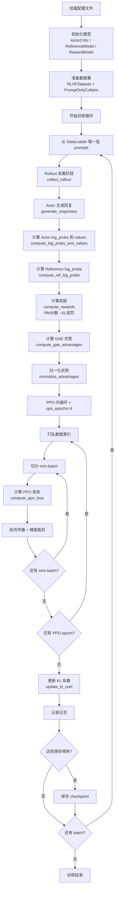

# RLHF-PPO 实现详解

## 1. 项目概述

### 1.1 什么是 RLHF

RLHF（Reinforcement Learning from Human Feedback，基于人类反馈的强化学习）是目前训练大型语言模型（LLM）使其与人类意图对齐的主流方法。其核心思想是：先收集人类对模型输出的偏好数据，训练一个奖励模型（Reward Model）来模拟人类偏好，再用强化学习算法优化语言模型，使其生成更符合人类期望的回复。

### 1.2 PPO 算法简介

PPO（Proximal Policy Optimization，近端策略优化）是 OpenAI 提出的一种 on-policy 强化学习算法。相比 TRPO，PPO 通过裁剪（clip）目标函数来约束策略更新幅度，实现简单且训练稳定，是目前 RLHF 中最常用的 RL 算法。

在 RLHF 场景下，PPO 的核心目标是：

$$\max_\theta \mathbb{E}_{x \sim \mathcal{D}, y \sim \pi_\theta(\cdot|x)} \left[ r_\phi(x, y) - \beta \cdot \text{KL}[\pi_\theta(\cdot|x) \| \pi_{\text{ref}}(\cdot|x)] \right]$$

其中 $r_\phi$ 是奖励模型打分，$\pi_{\text{ref}}$ 是参考模型（SFT 模型），$\beta$ 是 KL 惩罚系数。

### 1.3 本项目功能

本项目是一个基于 PPO 的完整 RLHF 训练框架，具备以下特性：

- 支持 Qwen2.5-7B-Instruct 作为 Actor/Reference 模型
- 支持 InternLM2-7B-Reward 作为奖励模型
- 支持 LoRA 微调，显著降低显存占用
- 支持 Flash Attention 和梯度检查点加速训练
- 支持 COIG-CQIA、UltraFeedback、HH-RLHF 等多个数据集
- 实现了完整的 GAE 优势估计、PPO 裁剪损失、自适应 KL 系数调整

---

## 2. 项目结构

```
rlhf-ppo/
├── config/
│   ├── model_config.yml          # 模型路径、数据集、生成参数、LoRA 配置
│   ├── ppo_config.yml            # PPO 超参数（clip、gamma、lam、学习率等）
│   └── eval_log_config.yml       # 输出目录、保存频率、评估频率
├── models/
│   ├── qwen2.5-7b-instruct/      # Actor 与 Reference 模型权重（共享）
│   └── internlm2-7b-reward/      # 奖励模型权重
├── scripts/
│   ├── train.py                  # 训练入口，实例化 PPOTrainer 并调用 train()
│   ├── download_model.py         # 从 hf-mirror.com 下载 Actor 模型
│   ├── download_reward_model.py  # 从 hf-mirror.com 下载奖励模型
│   └── download_dataset.py       # 下载并预处理数据集，保存为 JSONL
└── src/
    ├── data/
    │   ├── dataset.py            # RLHFDataset：加载 JSONL 或 HuggingFace 格式数据
    │   └── collator.py           # PromptOnlyCollator / FullSequenceCollator
    ├── models/
    │   ├── actor_critic.py       # ActorCritic：LLM + value head，支持 LoRA
    │   ├── reference_model.py    # ReferenceModel：冻结的 LLM，仅用于推理
    │   └── reward_model.py       # RewardModel：冻结的序列分类模型
    └── ppo/
        ├── rollout.py            # RolloutCollector：采样、计算 log_probs 和奖励
        ├── advantage.py          # GAE 优势函数计算与归一化
        ├── loss.py               # PPO 策略损失、价值损失、熵奖励
        └── trainer.py            # PPOTrainer：主训练循环，整合所有模块
```

### 各文件职责说明

| 文件 | 职责 |
|------|------|
| `config/model_config.yml` | 定义模型路径、数据集选择、序列长度、生成参数、LoRA 配置 |
| `config/ppo_config.yml` | 定义 PPO 算法超参数和奖励模型配置 |
| `config/eval_log_config.yml` | 定义输出路径和训练监控频率 |
| `src/data/dataset.py` | 统一数据加载接口，支持多种数据集格式 |
| `src/data/collator.py` | 批处理逻辑，分别处理仅 prompt 和完整序列两种场景 |
| `src/models/actor_critic.py` | 核心可训练模型，包含语言模型主干和价值头 |
| `src/models/reference_model.py` | 冻结的参考策略，用于计算 KL 散度 |
| `src/models/reward_model.py` | 冻结的奖励模型，为生成的回复打分 |
| `src/ppo/rollout.py` | 在线采样阶段，收集训练所需的所有数据 |
| `src/ppo/advantage.py` | 实现 GAE 算法，估计每个 token 的优势值 |
| `src/ppo/loss.py` | 实现 PPO 的三项损失函数 |
| `src/ppo/trainer.py` | 顶层训练器，协调所有模块完成完整训练循环 |

---

## 3. 核心概念：四个模型的角色

RLHF-PPO 训练中同时涉及四个模型，理解它们的关系是理解整个框架的关键。

### 3.1 Actor 模型（策略网络）

Actor 是我们要训练的语言模型，对应强化学习中的"策略" $\pi_\theta$。它接收用户的 prompt，生成回复。训练目标是让它生成的回复获得更高的奖励，同时不偏离参考模型太远。

- 实现类：`ActorCritic`（`src/models/actor_critic.py`）
- 基础模型：Qwen2.5-7B-Instruct
- 训练方式：LoRA 微调（仅更新少量参数）
- 参数量：约 7B，但 LoRA 只训练约 0.1% 的参数

### 3.2 Critic 模型（价值网络）

Critic 估计当前状态的期望累积奖励，即价值函数 $V(s)$。在本项目中，Critic 与 Actor 共享同一个 LLM 主干，在顶部额外添加一个线性层（value head）输出标量价值。

- 实现类：`ActorCritic`（与 Actor 同一个类）
- Value head：`nn.Linear(hidden_size, 1)`，作用于最后一层隐藏状态
- 训练方式：value head 使用较大学习率（1e-5），LLM 主干使用较小学习率（1e-6）

### 3.3 Reference 模型（参考策略）

Reference 模型是 Actor 的初始版本（SFT 模型），在整个训练过程中保持冻结。它的作用是提供一个"基准"，通过 KL 散度惩罚防止 Actor 偏离太远，避免奖励黑客（reward hacking）。

- 实现类：`ReferenceModel`（`src/models/reference_model.py`）
- 基础模型：与 Actor 相同（Qwen2.5-7B-Instruct）
- 状态：完全冻结（`requires_grad_(False)`），始终处于 eval 模式
- 作用：计算参考 log 概率，用于 KL 惩罚项

### 3.4 Reward 模型（奖励模型）

Reward 模型是一个序列分类模型，输入 prompt+response，输出一个标量分数，代表该回复的质量。它在训练前已经通过人类偏好数据训练好，在 RLHF 阶段保持冻结。

- 实现类：`RewardModel`（`src/models/reward_model.py`）
- 基础模型：InternLM2-7B-Reward（`AutoModelForSequenceClassification`，`num_labels=1`）
- 状态：完全冻结，始终处于 eval 模式
- 输入格式：`<|im_start|>user\n{prompt}<|im_end|>\n<|im_start|>assistant\n{response}<|im_end|>`

### 3.5 四模型关系图

```
训练数据 (prompts)
       │
       ▼
┌─────────────┐    生成回复     ┌──────────────────┐
│   Actor     │ ─────────────► │  生成的回复        │
│  (可训练)   │                └──────────────────┘
└─────────────┘                        │
       │                               ├──────────────────────────┐
       │ 共享主干                       │                          │
       ▼                               ▼                          ▼
┌─────────────┐              ┌──────────────────┐    ┌──────────────────┐
│   Critic    │              │  Reward Model    │    │ Reference Model  │
│  (可训练)   │              │   (冻结)         │    │    (冻结)        │
│  价值估计   │              │  输出奖励分数     │    │  输出参考log概率  │
└─────────────┘              └──────────────────┘    └──────────────────┘
       │                               │                          │
       │ V(s)                          │ r_φ(x,y)                │ log π_ref
       └───────────────────────────────┴──────────────────────────┘
                                       │
                                       ▼
                              计算 GAE 优势 + PPO 损失
                                       │
                                       ▼
                              更新 Actor + Critic 参数
```

---

## 4. 训练流程

### 4.1 整体流程图



### 4.2 逐步详解

#### 步骤 1：初始化（`PPOTrainer.__init__` + `setup()`）

训练器加载三个配置文件（`model_config.yml`、`ppo_config.yml`、`eval_log_config.yml`），初始化：
- `kl_coef = 0.1`：KL 惩罚系数初始值
- `target_kl = 0.01`：目标 KL 散度，用于自适应调整
- `global_step = 0`：全局步数计数器

`setup()` 方法依次创建：
1. `ActorCritic`（含 LoRA 和 value head）
2. `ReferenceModel`（冻结）
3. `RewardModel`（冻结）
4. `RolloutCollector`（持有上述三个模型的引用）
5. `AdamW` 优化器（两个参数组：backbone lr=1e-6，value_head lr=1e-5）

#### 步骤 2：Rollout 采集（`RolloutCollector.collect_rollout()`）

这是 on-policy 训练的核心阶段，每个训练步都需要用当前策略重新采样。

**2a. 生成回复**（`generate_responses`）

```python
# 对 prompt 进行 tokenize，截断到 max_seq_len - max_new_tokens
# 调用 actor_critic.generate() 采样
# 切片得到 response_ids = full_output[:, input_ids.shape[1]:]
# 解码为文本
```

**2b. 计算 Actor log_probs 和 values**（`compute_log_probs_and_values`）

将 prompt+response 拼接后送入 ActorCritic：
- 对 logits 做 log_softmax，在对应 token 位置 gather，得到每个 token 的 log 概率
- 从最后一层隐藏状态经 value_head 得到每个位置的价值估计
- 创建 loss_mask：prompt 位置为 0，response 位置为 1

**2c. 计算 Reference log_probs**（`compute_ref_log_probs`）

相同的输入送入 ReferenceModel（无梯度），得到参考策略的 log 概率。

**2d. 计算奖励**（`compute_rewards`）

奖励由两部分组成：
- 奖励模型分数 $r_\phi(x, y)$：仅在序列最后一个 token 处赋予
- KL 惩罚：每个 response token 都有

$$\text{reward}[t] = \begin{cases} -\beta \cdot \text{KL}[t] & \text{if } t < T-1 \\ r_\phi(x,y) - \beta \cdot \text{KL}[T-1] & \text{if } t = T-1 \end{cases}$$

其中 $\text{KL}[t] = \log\pi_\theta(a_t|s_t) - \log\pi_{\text{ref}}(a_t|s_t)$

#### 步骤 3：GAE 优势计算（`compute_gae_advantages`）

GAE（Generalized Advantage Estimation）在偏差和方差之间取得平衡：

$$\delta_t = r_t + \gamma V(s_{t+1}) - V(s_t)$$

$$A_t^{\text{GAE}} = \sum_{l=0}^{\infty} (\gamma\lambda)^l \delta_{t+l}$$

实现上从序列末尾向前迭代：

```python
advantage = 0
for t in reversed(range(seq_len)):
    delta = rewards[t] + gamma * values[t+1] - values[t]
    advantage = delta + gamma * lam * advantage
    advantages[t] = advantage
    returns[t] = advantage + values[t]
```

参数：`gamma=0.99`（折扣因子），`lam=0.95`（GAE lambda）

#### 步骤 4：优势归一化（`normalize_advantages`）

只在 response token 位置（loss_mask=1）计算均值和标准差：

$$\hat{A}_t = \frac{A_t - \mu_{\text{response}}}{\sigma_{\text{response}} + \epsilon}$$

归一化有助于稳定训练，防止优势值过大导致梯度爆炸。

#### 步骤 5：PPO 内循环（`train_step` × ppo_epochs）

对同一批 rollout 数据重复训练 `ppo_epochs=4` 次，每次：
1. 打乱数据索引
2. 切分为 mini-batch（`mini_batch_size=2`）
3. 对每个 mini-batch 调用 `compute_ppo_loss`，反向传播，梯度裁剪（`max_grad_norm=1.0`），更新参数

#### 步骤 6：自适应 KL 系数更新（`update_kl_coef`）

```python
if mean_kl > target_kl * 1.5:
    kl_coef = min(kl_coef * 1.5, 10.0)   # KL 过大，增大惩罚
elif mean_kl < target_kl / 1.5:
    kl_coef = max(kl_coef / 1.5, 1e-4)   # KL 过小，减小惩罚
```

这确保 Actor 与 Reference 的 KL 散度维持在 `target_kl=0.01` 附近。

---

## 5. 数据处理

### 5.1 RLHFDataset（`src/data/dataset.py`）

数据集类支持两种加载方式：

1. **预处理 JSONL**：如果 `processed_data_path` 存在，直接加载，每行是一个 JSON 对象
2. **原始 HuggingFace 格式**：从磁盘加载 HuggingFace Dataset，按需处理

每条数据的格式：
```json
{
  "prompt": "用户的问题或指令",
  "chosen": "人类偏好的回复（可选）",
  "rejected": "人类不偏好的回复（可选）"
}
```

在 PPO 训练阶段，只使用 `prompt` 字段，`chosen`/`rejected` 是可选的（用于其他训练阶段如 SFT/DPO）。

### 5.2 PromptOnlyCollator（`src/data/collator.py`）

用于 PPO 训练的 DataLoader，只处理 prompt：

```python
# 对 prompts 进行 tokenize，左填充（left padding）
# 返回：input_ids, attention_mask, prompts（原始文本列表）
```

注意使用左填充（`padding_side='left'`），这样生成时所有序列的实际内容都在右侧，便于批量生成。

### 5.3 FullSequenceCollator（`src/data/collator.py`）

用于监督微调场景，处理完整的 prompt+response 序列：

```python
# 使用 chat template 格式化完整对话
# 创建 loss_mask：prompt token 位置为 0，response token 位置为 1
# 右填充到 batch 内最大长度
```

### 5.4 数据集下载与预处理（`scripts/download_dataset.py`）

**COIG-CQIA 数据集**：
- 合并多个子集：zhihu、douban、wikihow、wiki、segmentfault
- 按 95/5 比例划分训练集和验证集
- 保存为 JSONL 格式

**HH-RLHF 风格数据集**：
- 从多轮对话中提取最后一个 Human/Assistant 轮次
- 将 `chosen` 和 `rejected` 字段中的最后一轮 assistant 回复提取出来

---

## 6. 模型架构

### 6.1 ActorCritic（`src/models/actor_critic.py`）

ActorCritic 是整个框架中唯一需要训练的模型，它将语言模型主干和价值头合二为一。

**初始化流程：**

```python
# 1. 加载 AutoModelForCausalLM（bfloat16，device_map="auto"）
# 2. 加载 AutoTokenizer，若无 pad_token 则设为 eos_token
# 3. 添加 value_head = nn.Linear(hidden_size, 1)
# 4. 若 lora.enable=True，通过 peft 库应用 LoRA
# 5. 若配置了梯度检查点，调用 model.gradient_checkpointing_enable()
```

**LoRA 配置：**
- `r=8`：低秩矩阵的秩
- `lora_alpha=32`：缩放因子（实际缩放比例 = lora_alpha/r = 4）
- `lora_dropout=0.05`：LoRA 层的 dropout
- `target_modules`：q_proj, v_proj, k_proj, o_proj, gate_proj, up_proj, down_proj（覆盖注意力和 FFN 层）

**forward() 方法：**

```python
outputs = model(input_ids, attention_mask, output_hidden_states=True)
logits = outputs.logits                          # [B, T, vocab_size]
last_hidden = outputs.hidden_states[-1]          # [B, T, hidden_size]
values = value_head(last_hidden).squeeze(-1)     # [B, T]
return logits, values
```

**get_trainable_params() 方法：**

返回两个参数组，分别设置不同学习率：
```python
[
    {"params": backbone_params, "lr": 1e-6},    # LoRA 参数
    {"params": value_head_params, "lr": 1e-5},  # value head 参数
]
```

### 6.2 ReferenceModel（`src/models/reference_model.py`）

与 ActorCritic 使用相同的基础模型，但：
- 调用 `model.eval()` 和 `model.requires_grad_(False)`，完全冻结
- 推理时使用 `torch.inference_mode()` 和 `torch.autocast(dtype=bfloat16)` 加速
- 只返回 logits，没有 value head

**为什么需要 Reference Model？**

如果只用奖励模型优化，Actor 可能会学到"欺骗"奖励模型的方式（奖励黑客），生成奖励分高但质量差的回复。Reference Model 通过 KL 惩罚约束 Actor 不能偏离初始 SFT 模型太远，保持生成质量。

### 6.3 RewardModel（`src/models/reward_model.py`）

使用 `AutoModelForSequenceClassification`（`num_labels=1`）加载 InternLM2-7B-Reward。

**format_input() 方法：**

将 prompt 和 response 格式化为奖励模型期望的输入格式：
```
<|im_start|>user
{prompt}<|im_end|>
<|im_start|>assistant
{response}<|im_end|>
```

**compute_reward() 方法：**

```python
# 1. 对每个 (prompt, response) 对调用 format_input()
# 2. tokenize 后送入模型
# 3. 取 logits.squeeze(-1) 作为标量奖励分数
# 返回形状为 [batch_size] 的奖励张量
```

---

## 7. Rollout 采集详解

### 7.1 RolloutBatch 数据结构

`RolloutBatch` 是一个 dataclass，存储一次 rollout 采集的所有数据：

| 字段 | 形状 | 含义 |
|------|------|------|
| `input_ids` | `[B, T]` | prompt+response 的完整 token ids |
| `attention_mask` | `[B, T]` | 注意力掩码 |
| `action_log_probs` | `[B, T]` | Actor 在每个位置的 log 概率 |
| `ref_log_probs` | `[B, T]` | Reference 在每个位置的 log 概率 |
| `values` | `[B, T]` | Critic 在每个位置的价值估计 |
| `rewards` | `[B, T]` | 每个位置的奖励（含 KL 惩罚） |
| `prompts` | `List[str]` | 原始 prompt 文本 |
| `responses` | `List[str]` | 生成的 response 文本 |
| `prompt_lengths` | `[B]` | 每个样本的 prompt token 数量 |

### 7.2 generate_responses 详解

```python
def generate_responses(self, prompt_batch):
    # 1. tokenize prompts，截断到 max_seq_len - max_new_tokens
    #    确保生成后总长度不超过 max_seq_len
    input_ids = tokenizer(prompts, padding=True, truncation=True,
                          max_length=max_seq_len - max_new_tokens)

    # 2. 调用 actor_critic.generate()
    full_output_ids = actor_critic.generate(
        input_ids,
        do_sample=True,
        temperature=0.7,
        top_p=0.9,
        top_k=50,
        max_new_tokens=512
    )

    # 3. 切片得到 response 部分
    response_ids = full_output_ids[:, input_ids.shape[1]:]

    # 4. 解码为文本（skip_special_tokens=True）
    responses = tokenizer.batch_decode(response_ids, skip_special_tokens=True)
```

### 7.3 compute_log_probs_and_values 详解

这个方法计算 Actor 对完整序列（prompt+response）的 log 概率和价值估计：

```python
# 1. 前向传播
logits, values = actor_critic(full_input_ids, attention_mask)

# 2. 计算 log_probs（shift 操作：用位置 t 的 logits 预测位置 t+1 的 token）
shift_logits = logits[:, :-1, :]          # [B, T-1, V]
shift_input_ids = full_input_ids[:, 1:]   # [B, T-1]
log_probs = log_softmax(shift_logits).gather(-1, shift_input_ids)
# 在位置 0 填充 0，恢复到完整长度 [B, T]

# 3. 创建 loss_mask
# prompt 位置（0 到 prompt_len-1）为 0
# response 位置（prompt_len 到 T-1）为 1
```

### 7.4 compute_rewards 详解

奖励计算是 RLHF 的核心，将稀疏的 RM 分数和密集的 KL 惩罚结合：

```python
# 1. 获取奖励模型分数（每个样本一个标量）
rm_rewards = reward_model.compute_reward(prompts, responses)  # [B]

# 2. 计算每个 token 的 KL 散度
kl = action_log_probs - ref_log_probs  # [B, T]

# 3. 构建奖励张量
rewards = torch.zeros_like(action_log_probs)
for i in range(batch_size):
    p_len = prompt_lengths[i]
    # response 中间 token：只有 KL 惩罚
    rewards[i, p_len:-1] = -kl_coef * kl[i, p_len:-1]
    # response 最后一个 token：RM 分数 + KL 惩罚
    rewards[i, -1] = rm_rewards[i] - kl_coef * kl[i, -1]
```

这种设计将 RM 分数视为序列级奖励，在最后一个 token 处"发放"，而 KL 惩罚则分布在每个 response token 上。

---

## 8. 优势函数计算

### 8.1 GAE 算法（`src/ppo/advantage.py`）

GAE 通过引入参数 $\lambda$ 在 TD 误差（低方差高偏差）和 Monte Carlo 回报（高方差低偏差）之间插值：

**TD 误差（delta）：**
$$\delta_t = r_t + \gamma V(s_{t+1}) - V(s_t)$$

**GAE 优势：**
$$A_t^{\text{GAE}(\gamma,\lambda)} = \sum_{l=0}^{T-t-1} (\gamma\lambda)^l \delta_{t+l}$$

**目标回报（用于训练 Critic）：**
$$R_t = A_t^{\text{GAE}} + V(s_t)$$

**实现（从后向前迭代）：**

```python
def compute_gae_advantages(rewards, values, gamma=0.99, lam=0.95):
    B, T = rewards.shape
    advantages = torch.zeros_like(rewards)
    returns = torch.zeros_like(rewards)
    advantage = torch.zeros(B)

    for t in reversed(range(T)):
        next_value = values[:, t+1] if t < T-1 else 0
        delta = rewards[:, t] + gamma * next_value - values[:, t]
        advantage = delta + gamma * lam * advantage
        advantages[:, t] = advantage
        returns[:, t] = advantage + values[:, t]

    return advantages, returns
```

### 8.2 优势归一化（`normalize_advantages`）

归一化只在 response token 位置（`loss_mask=1`）进行，避免 prompt 位置的零值干扰统计：

```python
def normalize_advantages(advantages, loss_mask):
    # 只统计 response 位置的均值和标准差
    masked_adv = advantages * loss_mask
    mean = masked_adv.sum() / loss_mask.sum()
    var = ((advantages - mean) ** 2 * loss_mask).sum() / loss_mask.sum()
    std = var.sqrt()
    return (advantages - mean) / (std + 1e-8)
```

归一化的作用：
- 防止优势值量级过大导致梯度爆炸
- 使不同 batch 之间的优势值具有可比性
- 稳定训练过程

---

## 9. PPO 损失计算

### 9.1 三项损失（`src/ppo/loss.py`）

PPO 的总损失由三部分组成：

$$\mathcal{L}_{\text{total}} = \mathcal{L}_{\text{policy}} + c_v \mathcal{L}_{\text{value}} - c_e \mathcal{H}$$

其中 $c_v = 0.5$（`value_loss_coef`），$c_e = 0.01$（`entropy_coef`）。

#### 9.1.1 策略损失（Policy Loss）

PPO 的核心，通过裁剪防止策略更新过大：

$$r_t(\theta) = \frac{\pi_\theta(a_t|s_t)}{\pi_{\theta_{\text{old}}}(a_t|s_t)} = \exp(\log\pi_\theta - \log\pi_{\theta_{\text{old}}})$$

$$\mathcal{L}_{\text{policy}} = -\mathbb{E}_t \left[ \min\left( r_t(\theta) \hat{A}_t, \text{clip}(r_t(\theta), 1-\epsilon, 1+\epsilon) \hat{A}_t \right) \right]$$

其中 $\epsilon = 0.2$（`clip_range`）。

```python
log_ratio = current_log_probs - old_action_log_probs
ratio = log_ratio.exp()
clipped_ratio = ratio.clamp(1 - clip_range, 1 + clip_range)
policy_loss = -torch.min(ratio * advantages, clipped_ratio * advantages)
# 对 response token 取平均
policy_loss = (policy_loss * loss_mask).sum() / loss_mask.sum()
```

#### 9.1.2 价值损失（Value Loss）

使用裁剪的价值损失，防止价值函数更新过大：

$$\mathcal{L}_{\text{value}} = \frac{1}{2} \mathbb{E}_t \left[ \max\left( (V_\theta(s_t) - R_t)^2, (\text{clip}(V_\theta(s_t), V_{\text{old}} \pm \epsilon_v) - R_t)^2 \right) \right]$$

其中 $\epsilon_v = 0.2$（`value_clip_range`）。

```python
v_pred_clipped = old_values + (v_pred - old_values).clamp(
    -value_clip_range, value_clip_range
)
value_loss = 0.5 * torch.max(
    (v_pred - returns) ** 2,
    (v_pred_clipped - returns) ** 2
)
value_loss = (value_loss * loss_mask).sum() / loss_mask.sum()
```

#### 9.1.3 熵奖励（Entropy Bonus）

鼓励策略保持一定的随机性，防止过早收敛到确定性策略：

$$\mathcal{H}(\pi_\theta) = -\sum_a \pi_\theta(a|s) \log\pi_\theta(a|s)$$

```python
# compute_entropy_from_logits：对 shift 后的 logits 计算每个位置的熵
probs = softmax(shift_logits)
entropy = -(probs * log_softmax(shift_logits)).sum(-1)  # [B, T-1]
entropy_bonus = (entropy * loss_mask).sum() / loss_mask.sum()
```

### 9.2 辅助指标

`compute_ppo_loss` 还返回以下监控指标：

| 指标 | 计算方式 | 含义 |
|------|----------|------|
| `approx_kl` | `0.5 * (log_ratio^2).mean()` | 近似 KL 散度，监控策略变化幅度 |
| `clip_fraction` | `(ratio < 1-ε 或 ratio > 1+ε).mean()` | 被裁剪的比例，过高说明更新步长太大 |

---

## 10. 训练器详解

### 10.1 PPOTrainer 完整流程（`src/ppo/trainer.py`）

```python
class PPOTrainer:
    def __init__(self):
        # 加载三个配置文件
        # 初始化 kl_coef=0.1, target_kl=0.01, global_step=0

    def setup(self):
        # 初始化 ActorCritic, ReferenceModel, RewardModel
        # 初始化 RolloutCollector
        # 初始化 AdamW 优化器（两个参数组）

    def prepare_dataloader(self):
        # 创建 RLHFDataset + PromptOnlyCollator
        # 创建 DataLoader（shuffle=True）

    def train(self):
        for epoch in range(num_train_epochs):
            for batch in dataloader:
                # === Rollout 阶段 ===
                rollout_batch, kl_divs = rollout_collector.collect_rollout(
                    batch, kl_coef
                )

                # === 优势计算阶段 ===
                loss_mask = compute_loss_mask(rollout_batch.prompt_lengths)
                advantages, returns = compute_gae_advantages(
                    rollout_batch.rewards, rollout_batch.values, gamma, lam
                )
                advantages = normalize_advantages(advantages, loss_mask)

                # === PPO 内循环 ===
                for ppo_epoch in range(ppo_epochs):
                    indices = torch.randperm(batch_size)
                    for mini_batch_indices in indices.split(mini_batch_size):
                        loss_dict = self.train_step(
                            rollout_batch, advantages, returns,
                            loss_mask, mini_batch_indices
                        )
                        loss_dict['loss'].backward()
                        clip_grad_norm_(params, max_grad_norm)
                        optimizer.step()
                        optimizer.zero_grad()

                # === 更新 KL 系数 ===
                mean_kl = kl_divs.mean()
                self.update_kl_coef(mean_kl)
                self.global_step += 1

                # === 日志与保存 ===
                if global_step % log_freq == 0:
                    self.log_metrics(loss_dict, mean_kl)
                if global_step % save_freq == 0:
                    self.save_checkpoint()
```

### 10.2 Checkpoint 保存

`save_checkpoint()` 保存以下内容：
- 模型权重（LoRA 参数 + value head）
- 优化器状态
- `global_step`（用于恢复训练进度）
- `epoch`（当前训练轮次）
- `kl_coef`（当前 KL 系数，确保恢复后行为一致）

保存路径：`checkpoints/step_{global_step}/`

### 10.3 自适应 KL 系数的作用

KL 系数 $\beta$ 控制 Actor 与 Reference 之间的距离：
- $\beta$ 过大：Actor 被过度约束，无法有效学习
- $\beta$ 过小：Actor 可能偏离 Reference 太远，产生奖励黑客

自适应调整策略：
```
mean_kl > target_kl × 1.5  →  kl_coef × 1.5（上限 10.0）
mean_kl < target_kl / 1.5  →  kl_coef / 1.5（下限 1e-4）
```

---

## 11. 配置参数详解

### 11.1 model_config.yml

```yaml
model:
  actor_model_path: models/qwen2.5-7b-instruct  # Actor/Reference 模型路径
  dtype: bfloat16                                # 模型精度（节省显存）
  device: cuda                                   # 运行设备
  max_seq_len: 1024                              # 最大序列长度（prompt+response）
  max_new_tokens: 512                            # 最大生成 token 数
  use_flash_attention: true                      # 使用 Flash Attention 2 加速
  use_gradient_checkpointing: true               # 梯度检查点（节省显存，略慢）

generation:
  temperature: 0.7    # 采样温度（越高越随机）
  top_p: 0.9          # nucleus sampling 阈值
  top_k: 50           # top-k sampling 候选数

dataset:
  current_dataset: coig_cqia  # 当前使用的数据集
  # 支持：coig_cqia, ultrafeedback, hh_rlhf

lora:
  enable: true
  r: 8                # LoRA 秩（越大参数越多，表达能力越强）
  lora_alpha: 32      # 缩放因子（实际缩放 = alpha/r = 4）
  lora_dropout: 0.05  # LoRA dropout
  target_modules:     # 应用 LoRA 的模块
    - q_proj
    - v_proj
    - k_proj
    - o_proj
    - gate_proj
    - up_proj
    - down_proj
```

### 11.2 ppo_config.yml

```yaml
training:
  num_train_epochs: 1    # 训练轮数（on-policy 通常只需 1 轮）
  ppo_epochs: 4          # 每批 rollout 数据重复训练的次数
  batch_size: 8          # 每步采样的 prompt 数量
  mini_batch_size: 2     # PPO 内循环的 mini-batch 大小

ppo:
  clip_range: 0.2        # 策略比率裁剪范围 [1-ε, 1+ε]
  value_clip_range: 0.2  # 价值函数裁剪范围

gae:
  gamma: 0.99            # 折扣因子（接近 1 表示重视长期奖励）
  lam: 0.95              # GAE lambda（越小偏差越大方差越小）

loss:
  value_loss_coef: 0.5   # 价值损失权重
  entropy_coef: 0.01     # 熵奖励权重（鼓励探索）

optimizer:
  learning_rate:
    backbone: 1e-6       # LLM 主干（LoRA 参数）学习率
    value_head: 1e-5     # 价值头学习率（比主干大 10 倍）
  max_grad_norm: 1.0     # 梯度裁剪阈值

reward_model:
  name: internlm/internlm2-7b-reward
  path: models/internlm2-7b-reward
  dtype: bfloat16
  # 输入格式模板
  prompt_template: "<|im_start|>user\n{prompt}<|im_end|>\n<|im_start|>assistant\n{response}<|im_end|>"
```

### 11.3 eval_log_config.yml

```yaml
output:
  output_dir: outputs        # 所有输出的根目录
  save_dir: checkpoints      # checkpoint 保存子目录
  log_dir: logs              # 日志保存子目录

frequency:
  save_freq: 10              # 每 10 步保存一次 checkpoint
  eval_freq: 10              # 每 10 步评估一次（当前未实现）
  log_freq: 1                # 每步都打印日志

logging:
  enable_wandb: false        # 是否使用 Weights & Biases
  enable_tensorboard: true   # 是否使用 TensorBoard
```

---

## 12. 快速开始

### 12.1 环境准备

```bash
pip install torch transformers peft datasets huggingface_hub pyyaml tqdm
```

### 12.2 下载模型

```bash
# 下载 Actor/Reference 模型（Qwen2.5-7B-Instruct）
python scripts/download_model.py

# 下载奖励模型（InternLM2-7B-Reward）
python scripts/download_reward_model.py
```

### 12.3 下载并预处理数据集

```bash
# 在 config/model_config.yml 中设置 current_dataset，然后：
python scripts/download_dataset.py
```

### 12.4 启动训练

```bash
python scripts/train.py \
    --model_config config/model_config.yml \
    --ppo_config config/ppo_config.yml \
    --eval_log_config config/eval_log_config.yml
```

### 12.5 切换数据集

修改 `config/model_config.yml` 中的 `current_dataset` 字段：

```yaml
datasets:
  current_dataset: "ultrafeedback"  # 改为 ultrafeedback 或 hh_rlhf
```

---

## 13. 关键设计决策

### 13.1 Actor 与 Reference 共享同一个基础模型

本项目中 Actor 和 Reference 都从 `models/qwen2.5-7b-instruct` 加载，但它们是独立的两个实例。Actor 通过 LoRA 微调，Reference 完全冻结。这样设计的好处是：
- 节省磁盘空间（只需一份基础权重）
- 确保 KL 散度的基准是 SFT 模型本身

### 13.2 loss_mask 的重要性

所有损失计算都只在 response token 位置（`loss_mask=1`）进行，prompt token 不参与梯度计算。这是因为：
- Prompt 是固定输入，不是 Actor 的"行为"
- 对 prompt token 计算策略损失没有意义
- 优势归一化也只在 response 位置统计，避免 prompt 位置的零值干扰

### 13.3 奖励在最后一个 token 处发放

RM 分数是序列级别的（对整个 response 打一个分），但 PPO 需要 token 级别的奖励。本项目将 RM 分数赋予序列最后一个 token，其余 response token 只有 KL 惩罚。这是 InstructGPT 论文中的标准做法。

### 13.4 LoRA 显著降低显存需求

7B 模型全量微调需要约 80GB+ 显存，而 LoRA（r=8）只需约 20-30GB。同时 PPO 需要同时加载 Actor、Reference、Reward 三个模型，LoRA 使得在单机多卡环境下训练成为可能。

### 13.5 ppo_epochs > 1 的权衡

对同一批 rollout 数据训练多次（`ppo_epochs=4`）可以提高数据利用率，但会增加 off-policy 程度（因为每次更新后策略已经改变）。PPO 的裁剪机制正是为了限制这种偏差，`clip_range=0.2` 确保每次更新不会太激进。
